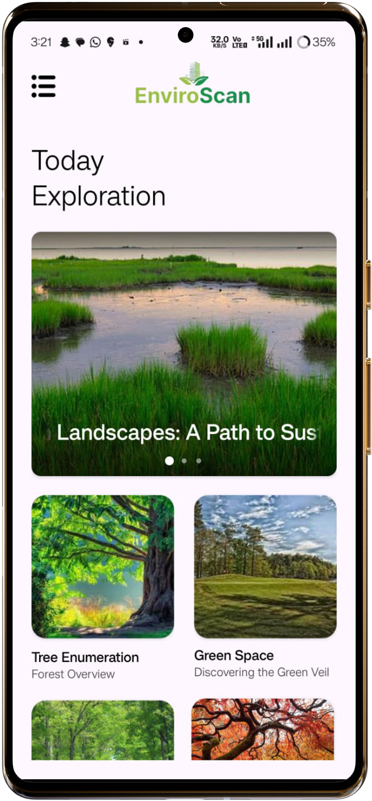
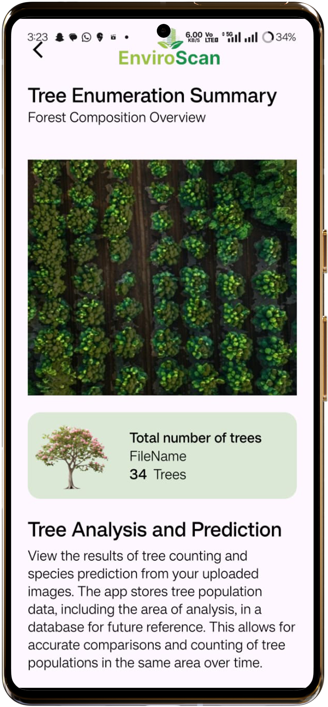
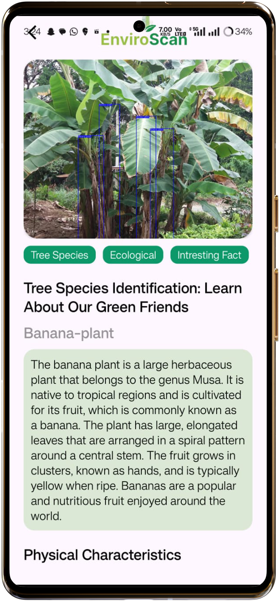
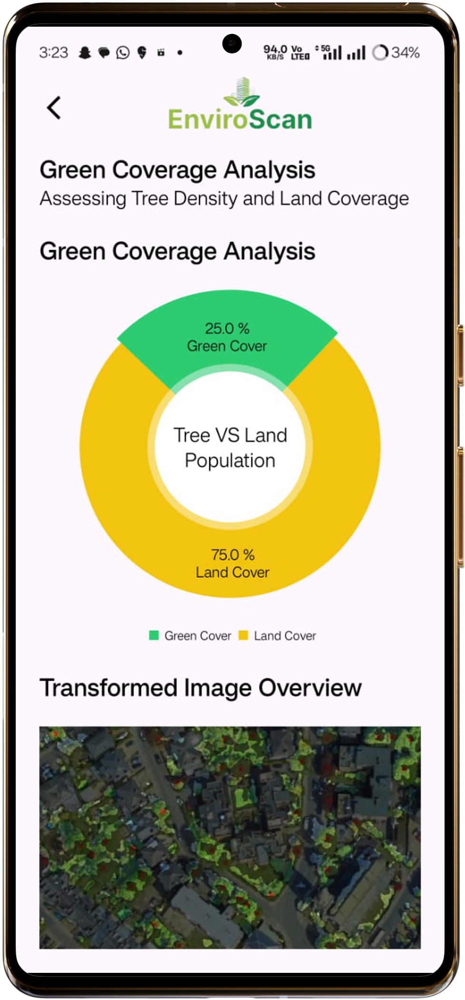
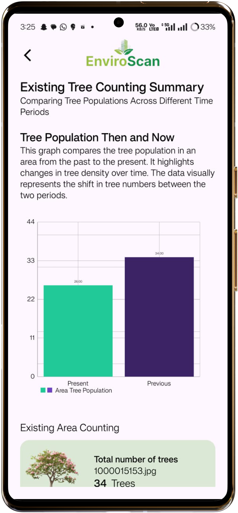

# 📱 EnviroScan — Android Application for Tree Enumeration and Environmental Analysis

**Download APK**: [Click Here to Download EnviroScan App](your-apk-download-link-here)

---

## 📖 About the App

**EnviroScan** is a powerful mobile application that brings the capabilities of tree enumeration and green space analysis directly to your Android device.  
Built using deep learning technology with YOLOv8 models, EnviroScan allows users to count trees, identify tree species, segment land areas, and compare changes in forest cover — all through a simple mobile interface.

---
## 📸 Screenshots

| Home Screen | Tree Counting | Species Identification | Green-Land Separation | Tree Comparison | 
|:-----------:|:--------------:|:-----------------------:|:----------------------:|:---------------:|
|  |  |  |  |  |

---

## 🚀 Core Functionalities

### 1. **Tree Counting from Satellite Images**
- Upload a satellite image and instantly detect and count the number of trees.
- Powered by a lightweight, mobile-optimized YOLOv8 detection model.

### 2. **Tree Species Identification**
- Analyze tree images and classify them into specific species categories.
- Utilizes a fine-tuned classification layer on top of YOLOv8 for species detection.

### 3. **Green Space and Land Space Separation**
- Segment green areas from barren or developed land regions.
- Uses a semantic segmentation algorithm for pixel-level land cover analysis.

### 4. **Tree Count Comparison (Temporal Analysis)**
- Compare past and current images to detect increases or losses in tree count.
- Supports multi-temporal environmental change detection for forest conservation efforts.

---

## 🛠️ Technologies and Tools Used

- **Programming Language**: Java, XML
- **Deep Learning Model**: YOLOv8 (optimized for mobile inference)
- **Training Platform**: Roboflow (custom dataset preparation and augmentation)
- **Android Framework**: Android Studio (SDK 34+)
- **Model Integration**: TensorFlow Lite (TFLite conversion of YOLOv8 models)
- **Libraries**:
  - TensorFlow Lite Support Library
  - OpenCV for Android (Image Preprocessing)
  - Glide (Efficient image loading)
  - Retrofit2 (for potential API calls)
- **Deployment Format**: APK (Android Package Kit)
- **Minimum Supported Android Version**: Android 8.0 (Oreo) and above

---

## 📦 How to Install

1. Download the APK file from the link above.
2. Enable "Install from Unknown Sources" in your Android settings.
3. Tap the APK and install the app.
4. Open EnviroScan and start analyzing your environment!

---

## 📊 Performance Metrics

| Metric                         | Value               |
|---------------------------------|---------------------|
| Tree Detection Accuracy        | 79.8%               |
| Species Identification Accuracy| 78.6%               |
| Inference Time per Image        | ~300 ms             |
| APK Size                        | ~14.81 MB              |

---

## 🔒 Security

- Models are embedded and protected inside the APK.
- No user data is collected or transmitted externally.
- Offline functionality ensures privacy and data security.

---

## 📚 Future Roadmap

- Add live camera-based tree counting mode.
- Support offline maps integration for geo-tagged tree enumeration.
- Enable push notifications for environmental news and updates.
- Implement dark mode for improved accessibility.

---

## 📜 License

This project is licensed under the **MIT** — see the `LICENSE.md` file for details.

---

# 🌿 Empowering the Future of Forest Conservation Through AI.

---
